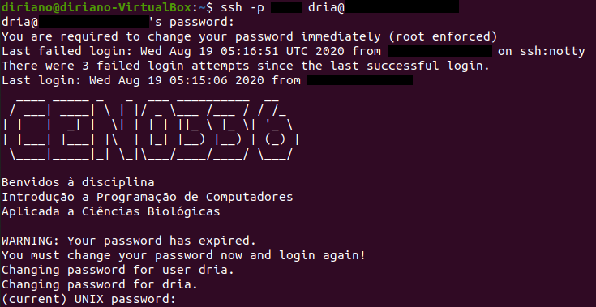
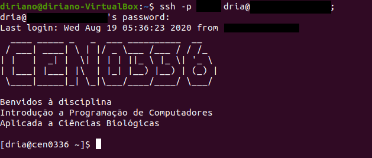

# Introdução a programação de computadores aplicada a ciências biológicas - CEN0336 2020-20
Tradução e modificação do material associado a [programmingforbiology.org](http://programmingforbiology.org), associado a disciplina ["CEN0336 - Introdução a Programação de Computadores Aplicada a Ciências Biológicas"](https://uspdigital.usp.br/jupiterweb/obterDisciplina?sgldis=CEN0336&codcur=11061&codhab=4)

__Criador e Instrutor da versão em Português__
Diego M. Riaño-Pachón

__Criadores do material na versão em Inglês__  
Simon Prochnik  
Sofia Robb     

# Panorama geral

## Por que?

Por que é importante para profissionais das ciências da vida aprender a programar?

Possivelmente você já tem a resposta a essa pergunta, a final das contas, você está aqui!

Estmaos convencidos que saber programar é tão essencial quanto fazer uma electroforese em gel o preparar uma reação de PCR. Os dados que hoje podemos obter de um só experimento podem ser esmagadores. i Esse dados muitas vezes precisam ser reformatados, filtrados e analizados de formas únicas. A programação de computadores permitirá que você execute essas taferas de uma maneira **eficiente** e **reproducivel**.


## Dicas úteis

Algumas dicas para cursar uma disciplina de programação com sucesso


1. Pratica, pratica, pratica. Por favor, invista tnato tempo como seja possivel escrevendo código.

2. Limite-se a escrever uma linha ou duas de codigo, e teste-las. Se você escreve muitas linhas, será mais dificil corregir os erros (debug), caso tiver.

3. Os erros não são fracassos. Cada erro é uma oportunidade de aprendizagem. Cada erro que você pesca e corrige (debug) e um grande sucesso. Corregir erros é como você cimenta seu aprendizado.

4. Não gaste muito tempo tentando descifrar um problema. Claro, é uma experiencia de aprendizado resolver os problemas você mesmo, mas a frustração e o bloqueio não são. Estamos aqui para ajuda-los, pergunte cada vez que precisar.

5. As palestras são importantes, mas a pratica e muito mais importante.

6. Sessões de revisão são importantes, mas a pratica e muito mais importante.

7. Nosso principal objetivo é ensinar-les a resolver problemas vocês mesmo, devagar mas com segurança.

---

# Unix

## Unix 1

### Panorama de Unix

#### O que é a linha de comandos?

Subjacente a qualsquer interface gráfica (GUI) existe um poderoso sistema operacional (SO) de linha de comandos. A linha de comandos oferece acesso ao interior do SO, e é também uma forma conveniente de escrever software e scripts personalizados.

Muitas das ferramentas bioinformáticas são desenvolvidas para ser executadas na linha de comando e não ter uma GUI. Em muitos casos, uma ferramenta na linha de comandos e mais versatil que uma ferramente gráfica, já que você pode combinar facilmente diversas ferramentas de linha de comandos para criar scripts que realizem tarefas sem a intervenção de um humano.

Nesta disciplinas, vocês escreverão scripts na linguagem Python e os executarão exclusivamente desde uma linha de comandos.

### O básico

#### Detalhes para entrar no seu ambiente de trabalho

Nesta disciplina, neste semestre, usaremos um servidor Linux com CenOS 7, o endereço (IP), e porta de acesso, do servidor serão informados durante um dos encontros com o professor, por favor tome nota dessa informação e mantenha-la para uso rápido.

Para entrar no servidor, você tem que fornecer seu nome de usuário e a senha. Seu nome de usuário será a primeira letra do seu nome e as três primeiras letras do seu sobrenome. No sistema e-Disciplinas da USP tem uma tabela com os nomes de usuários de todos os alunos. A senha é CEN0336XXX, onde XXX são os três ultimos digitos do seu número USP.

Por exemplo, para o Prof. Diego Riano, o nome de usuário é: dria.

_Your username:_ dria

_Your password:_ CEN0336XXX

#### Conectando-se ao servidor

Para conectar ao servidor precisarão de um cliente de SSH (Secure shell). 

Os usuários de windows podem descarregar os software [Putty](https://www.chiark.greenend.org.uk/~sgtatham/putty/latest.html)

Os usuários de Linux ou de MacOS, já tem um cliente de ssh no sistema operacional, só tem que iniciar o aplicativo Terminal.

Detalhes para usar o cliente de SSH serão mostrados no encontro com o professor.

Na sua primeira entrada no servidor, terá que trocar sua senha. Por favor escolha uma senha dificil de adivinhar. O servidor pedirá usa senha original duas vezes, e depois você terá que digitar sua nova senha duas vezes. Será recebido por uma janela semelhante a seguinte:



Nessa primeira entrada, o servidor o desconectará imediatamente depois da troca da senha. Tem que se conectar de novo, desta vez usando a nova senha que escolheu no passo anterior. Estará numa janela semelhante a seguinte:



Você pode manter abertas varias janelas desse terminal. Isso geralmente é útil.

Durante a disciplina vamos usar muito esse terminal.

#### OK. Entrei no servidor. E agora?

A janela da terminal está executando uma **shell** chamada de "bash." A shell é um loop (ciclo) que:  
1. Imprime o prompt
2. Lê uma linha de entrada do teclado
3. Analisa a linha em um ou mais comandos
4. Executa os comandos (geralmente imprimindo algum tipo de daida na terminal)
5. Volta ao passo 1.


Existem muitas shells diferentes, com nomes bizarros como **bash**, **sh**, **csh**, **tcsh**, **ksh**, e **zsh**.  A particula "sh" no nome, significa shell.  Cada shell é sutilmente diferente e algumas vezes confusa. suas contas no servidor estão configuradas para usar a shell **bash**.


#### Prompt da linha de comandos


A maior parte da bioinformática é feita executando software numa shell da linha de comandos, por isso é importante aprender a usar a shell de forma efetiva.


Este é um exemplo de prompt na linha de comandos:

```
cen0336>
```


Aqui tem outro:

```
(~) 51%
```

Mais um:

```
dria@cen0336 1:12PM>
```

O que você vai ter como prompt depende de como o administrador do sistema fez a configuração. Mas, você pode mudá-lo, [claro depois de saber como!](https://linuxconfig.org/bash-prompt-basics).

O prompt indica à shell que está pronto para aceitar comandos. Quando um programa esta rodando, o prompt não aparece até que o sistema estiver pronto para lidar com uma nova solicitação.

#### Executando comandos


Escreva um comando e pressione a tecla &lt;Enter&gt;.  Se o comando produz alguma saida, esta aparecerá na tela.  Por exemplo:

```
(~) 53% ls -F
GNUstep/                 cool_elegans.movies.txt  man/
INBOX                    docs/                    mtv/
INBOX~                   etc/                     nsmail/
Mail@                    games/                   pcod/
News/                    get_this_book.txt        projects/
axhome/                  jcod/                    public_html/
bin/                     lib/                     src/
build/                   linux/                   tmp/
ccod/
(~) 54%
```

O comando aqui é `ls -F`, que gera uma lista dos arquivos e pastas dentro da pasta atual (já falaremos disso). Abaixo do comando aparece sua saída, é o prompt aparece novamente.


Alguns programas podem demorar muito tempo para rodar. Depois que você executa eles, não recuperará o prompt da shell até eles terminarem a tarefa que les foi encomendada. Nesse caso você poderia abrir um novo terminal par acontinuar seus trabalhos, ou rodar o comando no segundo plano adicionando o simbolo "&" após o comando, no final da linha.

```
(~) 54% long_running_application &
(~) 55%
```
> Assim o comando vai rodar no segundo plano até terminar. Se ele gerar alguma saida, ela vai aparecer na tela. Seria bom você capturar a saida num arquivo (isso é chamado de redirecionamento). Depois vamos descrever como fazer isso.


#### Edição da linha de comandos

A maioria das shells permite editar a linha de comandos.  Até o momento em que você pressiona a tecla \<Enter\>, você pode voltar na linha de comandos e editá-lo usando o teclado.  Aqui tem algumas das combinações de teclas mais úteis:

- _Backspace_: Apagar o caractere anterior.
- _zatra esquerda_, _zeta direita_: Move o ponto de inserção de texto (cursor) um caractere para a esquerda ou direita.
- _control-a (^a)_: Move o cursor para o início da linha. (Mnemônico: A é a primeira letra do alfabeto).
- _control-e (^e)_: Move o cursor até o final da linha. (Mnemônico: E pela palavra "End")
- _control-d (^d)_: Apagar o caractere atualmante abaixo do cursos. D=Delete.
- _control-k (^k)_: Apagar a linha desde onde esteja o cursor até o final. k=kill.  Na verdade a linha não é apagada, ela é colocada num local temporario chamado de "kill buffer". Isto é como cortar texto.
- _control-y (^y)_: Colar o conteúdo do "kill buffer" na linha de comandos, no ponto onde estiver o cursor.  y=yank.
- _zata acima_, _zeta abaixo_: Move o cursor para acima e para abaixo na historia de comandos.  Muito útil para rodar comandos que já foram rodados, possivelmente depois de modificá-los.

Tem também algun comando úteis da shell que você pode usar:

- `history` Mostra todos os comandos que você usour recentemente, numerados.
- `!<number>` Executar novamente um comando, baseado no seu número na historia (Você pode obter o número com o comando `history`).
- `!!` Executar novamente o comando imediatamente anterior.
- `!<piedaço de um comando>`: Executar novamente um comando anterior que comeãba como as letras indicadas.  Por exemplo, `!l` (a letra 'ele', não o número 1) executará novamente o comando `ls -F` que usamos no inicio deste capítulo.

A shell **bash** oferece as os serviçoes de auto-completar e correção ortográfica. Se você escreve parte de um comando e usa a tecla de tabulação, a shell mostrará para você todas as formas possiveis de completar o comando.  Por exemplo:

```
(~) 51% fd<tab><tab>
(~) 51% fd
fd2ps    fdesign  fdformat fdlist   fdmount  fdmountd fdrawcmd fdumount
(~) 51%
```
> Se você teclear tab após escrever um comando, mas antes de pressionar a tecla \<Enter\>, **bash** mostratá un lista de nomes de arquivos. Isto acontece por que muito comandos operam em arquivos.

#### Curingas

You can use wildcards when referring to files.  `*` stands for zero or more characters.  `?` stands for any single character.  For example, to list all files with the extension ".txt", run `ls` with the wildcard pattern "*.txt"

```
(~) 56% ls -F *.txt
final_exam_questions.txt  genomics_problem.txt
genebridge.txt            mapping_run.txt
```

Existem padr"oes mais avanzados de curingas, poder ler sobre eles na página de manual do **tcsh**.  Por exemplo, se você quer selecionar os arquivos que comencam com os caracteres  "f" ou "g" e que terminam com  ".txt", pode usar uma faixa de caracteres dentro de colchetes `[f-g]` como parte de seu curinga. Aqui tem um exemplo

```
(~) 57% ls -F [f-g]*.txt
final_exam_questions.txt  genebridge.txt            genomics_problem.txt
```

#### Lar doce lar


Quando você entra no servidor, chegará numa parte do sistema que é sua pasta pessoal, chamada de _home directory_.  Você pode fazer oque você quiser nessa area: pode criar e apagar arquivos e outras pastas. De forma geral, você não pode criar arquivos em outras pastas do sistema.

Sua pasta home está localizada dentro sistema de arquivos do servidor. Neste servidor, como na maioria dos sistemas Linux e muitos Unixes, esta pasta tem seu nome de usuário, e eatá localizada em `/home`. A rota completa é `/home/usuário`.  A shell permite abreviá-lo como `~usuário` (onde usuário é seu nome de usuário no sistema), ou simplesmente como `~`. Esse caractere bizarro é chamado de "til" ou "twiddle".

Para ver o que vovê tem na sua pasta home, execute os comandos:

```
(~) % cd ~/
(~) % ls -F
INBOX         Mail/         News/         nsmail/       public_html/
(~) % ls 
INBOX         Mail         News         nsmail       public_html

```

Qual é a difereça entre os comandos `ls -F` e `ls`?

Este comando mostra um arquivo "INBOX" e quatro pasta adicionais ("Mail", "News").  (A particula `-F` no comando liga a opção para saida sofisticada ('fancy'), que acrescente alguna caracteres especiais nas listas de pastas, para ajudá-lo na identificação do que está observando.  O simbolo `/` no final do nome de um arquivo indica que o arquivo é uma pasta.


Algumas pastas podem ter arquivos e outras pastas que não aparacem quando executa o comando `ls -F`, eles estão ocultos. Os nomes desses aquivos e pastas ocultos iniciam com um `.` ("ponto") . Para conseguir ver esses arquivos e pastas, tem que acrescentar uma `a` nas opções do comando `ls`:

```
(~) % ls -aF
./                .cshrc            .login            Mail/
../               .fetchhost        .netscape/        News/
.Xauthority       .fvwmrc           .xinitrc*         nsmail/
.Xdefaults        .history          .xsession@        public_html/
.bash_profile     .less             .xsession-errors
.bashrc           .lessrc           INBOX
```
> Whoa!   Tem um monte de coisas lá. Pero por favor não vai apagar eses aquivos. Muitos deles são esenciais para a configuração de outros programas. Por exemplo o artuivo `.profile` contem as informações para a configuração da shell **bash**. Você pode dar uma olhadinha nele para ver algumas das muitas opções de **bash**. Você pode também editá-lo (claro quando você saiba o que está fazendo) para modificar o comportamento da shell, como por exemplo o typo de prompt que você tem, o as rotas de busca de comandos.


#### Conhecendo o sistema de arquivos


Você pode se deslocar de uma pasta para outra usando o comando `cd`. Você só tem que dar o nome da pasta para onde você quer ir. Pode usar o comando  `pwd`para saber onde vocês está. Em algumas configurações o prompt também informa o nome da pasta onde você está.

```
(~/docs/grad_course/i) 56% cd
(~) 57% cd /
(/) 58% ls -F
bin/         dosc/        gmon.out     mnt/         sbin/
boot/        etc/         home@        net/         tmp/
cdrom/       fastboot     lib/         proc/        usr/
dev/         floppy/      lost+found/  root/        var/
(/) 59% cd ~/Mail/
(~/Mail) 60% pwd
/home/dria/Mail
(~/Mail) 62% cd ../News/
(~/News) 63% ls
Ace-browser/               bass.patch
Ace-perl/                  cgi/
Foo/                       cgi3/
Interface/                 computertalk/
Net-Interface-0.02/        crypt-cbc.patch
Net-Interface-0.02.tar.gz  fixer/
Pts/                       fixer.tcsh
Pts.bak/                   introspect.pl*
PubMed/                    introspection.pm
SNPdb/                     rhmap/
Tie-DBI/                   sbox/
ace/                       sbox-1.00/
atir/                      sbox-1.00.tgz
bass-1.30a/                zhmapper.tar.gz
bass-1.30a.tar.gz
(~/News) 64%
```
> Cada pasta tem duas pastas especiais chamadas de `.` e `..`. A primeira, `.` refere-se sempre ao diretório atual. `..` refere-se ao diretorio pai.  Desta forma você pode se deslocar para cima na hierarquia de diretórios:

```
(~/Mail) 64% cd ..
```

e pode fazer coisas arbitrariamente bizarras como esta:

```
(~/Mail) 65% cd ../../dria/Mail
```
> O ultimo comando sobe dois niveis, e logo vai na pasta Mail que está dentro da pasta chamada `dria`.


Se você ficar perdido no sistema de arquivos, o comando `pwd` imprimira a rota completa da pasta onde você está:

```
(~) 56% pwd
/home/dria
```

#### Comandos essenciais de Unix


Com exceção de poucos comandos que estão construidos diretamente na shell, todos os comandos de linux são programas executaveis autónomos. Quando você escreve um comando, a shell buscará em todas as pastas listadas na variavel de ambiente PATH por um executavel com o mesmo nome. Se acha-lo, então a shell o executará. Se não, imprimirá o erro "command not found".

A maioria dos comandos estão em `/bin`, `/usr/bin`, ou `/usr/local/bin`.

#### Obtendo informação dos comandos


O comando `man` le dará uma breve sinopsis do comando. Vamos obter informação do comando `wc`

```
(~) 76% man wc
Formatting page, please wait...
WC(1)                                                       WC(1)

NAME
       wc - print the number of bytes, words, and lines in files

SYNOPSIS
       wc [-clw] [--bytes] [--chars] [--lines] [--words] [--help]
       [--version] [file...]

DESCRIPTION
       This manual page documents the  GNU  version  of  wc.   wc
       counts  the  number  of bytes, whitespace-separated words,
...
```

#### Encontrando quais comandos estão disponiveís no seu computador

O comando `apropos` procurará comando que batem com uma palavra chave ou uma frase. Aqui tem um exemplo usando a palavra chave 'column'

```
(~) 100% apropos column
showtable (1)        - Show data in nicely formatted columns
colrm (1)            - remove columns from a file
column (1)           - columnate lists
fix132x43 (1)        - fix problems with certain (132 column) graphics
modes
```


#### Argumentos e switches na linha de comando


Muitos comandos aceitam argumentos.  Frequentemente os argumentos são os nomes de um ou mais arquivos nos quais o comando fará alguma operação. Muitos comandos também aceitam "switches" ou 'opções' na linha de comandos, que podem ajustar de forma fina o que o comando faz.  Alguns comandos reconhecem "switches' curtos, isto é, que consistem de um sinal de menos `-` seguido de um único caracter, enquanto outros reconhecem 'switches' longos, que consistem de dois sinais de menos `--` seguidos de uma palavra inteira.


O programa `wc` (word count) é um exemplo de comando que reconhece tanto opções longas como curtas. Você pode pasar as opções `-c`,  `-w` e/ou `-l` para contar caracteres, palavras e linhas num arquivo de texto, respectivamente. Ou você podde usar o formato mais longo das opções, mais facil de ler, `--chars`,  `--words` ou `--lines` .  Os proximos dois exemplos contam o número de caracteres e de linhas no arquivo de texto  `/var/log/messages`:

```
(~) 102% wc -c -l /var/log/messages
     23     941 /var/log/messages
(~) 103% wc --chars --lines /var/log/messages
     23     941 /var/log/messages
```

Você pode agrupar switches curtos, concatenando-lhes, como se mostra neste exemplo:

```
(~) 104% wc -cl /var/log/messages
     23     941 /var/log/messages
```

Muitos comandos mostrarão um pequeno resumo da forma de uso quando você chamar com as opções -h` ou `--help.

#### Espaços e caracteres extranhos

A shell usa espaços em branco (espaços, tabs, e outros catacteres não imprimíveis) para separar argumentos.  Se você deseja usar espeçoes em branco em um argumento, tem que usar aspas simples ao redor dele. For Exemplo: 

```
mail -s 'Uma mensagem importante' 'Bob Ghost <bob@ghost.org>'
```
Esse comando enviará uma mensage de e-mail para a pessoa fictisia Bob Ghost.  O switch `-s` aceita um argumento, que será o tema do e-mail.  Já que o tema desejado pode conter espaçoes, tem que usar aspas ao redor. De forma semelantes, meu nome e endereço de e-mail, que poden ter espeçoes, tem que usar aspas da mesma forma. 


Alguns caracteres especiais não imprimíveis têm _códigos de escape_ associados


| Código de Escape | Descrição                               |
| ----------- | -------------------------------------------- |
| \\n         | Caracter de linha nova                       |
| \\t         | Caracter tabulação (TAB)                     |
| \\r         | Caracter de retorno de carro                 |
| \\a         | Caracter de campainha (ding! ding!)          |
| \\nnn       | O caracter que tem cõdigo ASCII **nnn**      |


#### Comandos úteis

Aqui tem alguns comandos que são usados com muita frequência.  Pode usar o comando  `man` para parender mais deles.  Alguns desses comandos podem ser de muita utilidade para resolver alguns dos exercicios ;-)

#### Manipulando pastas

| Comando | Descripção                              |
| ------- | ---------------------------------------- |
| `ls`    | Mostrar em forma de lista o conteúdo de uma pasta. O uso mais frequente é como  `ls -F` (lista decorada), `ls -l` (lista larga), `ls -a` (listar todos os arquivos). |
| `mv`    | Renomear ou mover um arquivo ou pasta.      |
| `cp`    | Copiar um arquivo.                             |
| `rm`    | Apagar um arquivo.                  |
| `mkdir` | Criar uma pasta.                         |
| `rmdir` | Apagar uma pasta.                       |
| `ln`    | Criar um vínculo simbólico ou rigido.          |
| `chmod` | Mudar as permisões de um arquivo ou uma pasta. |


| Command           | Description                              |
| ----------------- | ---------------------------------------- |
| `cat`             | Programa para concatenar.  Pode ser usado para concatenar multiplos arquivos em um único arquivo, ou, com maior frequencia, para visualizar o conteúdo de um ou varios arquivo no terminal.|
| `echo`            | Imprime na tela uma copia de algum texto. E.g. `echo 'Hola Mundo!'` |
| `more`            | Navegar num arquivo pagina a pagina; Muito útil para visualizar o conteúdo de arquivos grandes. Funciona inclusive com arquivos que nem sequer podem ser visualizados num editor de texto. |
| `less`            | É uma versão do comando more, com ainda mais recursos..  |
| `head`            | Visualizar as primeiras linhas de um arquivo. Você pode controlar quantas linhas visualizar. |
| `tail`            | Vizualizar o final de um arquivo.  Você pode controlar quantas linhas visualizar.  Pode usar  `tail -f` para visualizar um arquivo onde está escrevendo. |
| `wc`              | contar palavras, linhas e/ou characteres em um ou mais arquivos. |
| `tr`              | Substituir um caracater por outro.  também é útil para apagar caracteres. |
| `sort`            | Ordenar as linhas de um arquivo de forma alfabetica ou numérica. |
| `uniq`            | Apagar linhas duplicada num arquivo.       |
| `cut`             | Apagar colunas de cada linha de um ou mais arquivos. |
| `fold`            | Ajustar o comprimento de linha a um maximo especificado. |
| `grep`            | Filter a file for lines matching a specified pattern.  Can also be reversed to print out lines that don't match the specified pattern. |
| `gzip` (`gunzip`) | Compress (uncompress) a file.            |
| `tar`             | Archive or unarchive an entire directory into a single file. |
| `emacs`           | Run the Emacs text editor (good for experts). |
| `vi`              | Run the vi text editor (better for experts). |


#### Networking

| Command                | Description                              |
| ---------------------- | ---------------------------------------- |
| `ssh`                  | A secure (encrypted) way to log into machines. |
| `scp`                  | A secure way to copy (cp) files to and from remote machines. |
| `ping`                 | See if a remote host is up.              |
| `ftp`/ `sftp` (secure) | Transfer files using the File Transfer Protocol. |

#### Standard I/O and Redirection


Unix commands communicate via the command-line interface.  They can print information out to the terminal for you to see, and accept input from the keyboard (that is, from _you_!)


Every Unix program starts out with three connections to the outside world.  These connections are called "streams", because they act like a stream of information (metaphorically speaking):


| Stream Type     | Description                              |
| --------------- | ---------------------------------------- |
| standard input  | This is a communications stream initially attached to the keyboard.  When the program reads from standard input, it reads whatever text you type in. |
| standard output | This stream is initially attached to the terminal. Anything the program prints to this channel appears in your terminal window. |
| standard error  | This stream is also initially attached to the terminal. It is a separate channel intended for printing error messages. |

The word "initially" might lead you to think that standard input, output, and error can somehow be detached from their starting places and reattached somewhere else.  And you'd be right.  You can attach
one or more of these three streams to a file, a device, or even to another program.  This sounds esoteric, but it is actually very useful.

#### A Simple Example


The `wc` program counts lines, characters, and words in data sent to its standard input.  You can use it interactively like this:

```
(~) 62% wc
Mary had a little lamb,
little lamb,
little lamb.

Mary had a little lamb,
whose fleece was white as snow.
^d * NOTE - this needs to be typed but will not be show up in terminal window
      6      20     107
```
In this example, I ran the `wc` program.  It waited for me to type in a little poem.  When I was done, I typed the END-OF-FILE character, control-d (^d for short).  `wc` then printed out three numbers indicating the number of lines, words, and characters in the input.

More often, you'll want to count the number of lines in a big file; say a file filled with DNA sequences.  You can do this by _redirecting_ the contents of a file to the standard input of  `wc`. This uses
the `<`  symbol:

```
(~) 63% wc < big_file.fasta
      2943    2998     419272
```

If you wanted to record these counts for posterity, you could redirect standard output as well using the `>` symbol:

```
(~) 64% wc < big_file.fasta > count.txt
```


Now if you `cat` the file _count.txt_, you'll see that the data has been recorded.  `cat` works by taking its standard input and copying it to standard output.  We redirect standard input from the _count.txt_ file, and leave standard output at its default, attached to the terminal:

```
(~) 65% cat < count.txt
      2943    2998     419272
```

#### Redirection Meta-Characters

Here's the complete list of redirection commands for `bash`:

| Redirect command    | Description                              |
| ------------------- | ---------------------------------------- |
| `< myfile.txt`      | Redirect the contents of the file to standard input |
| `> myfile.txt`      | Redirect standard output to file         |
| `>> logfile.txt`    | Append standard output to the end of the file |
| `1 > myfile.txt`    | Redirect just standard output to file (same as above) |
| `2 > myfile.txt`    | Redirect just standard error to file     |
| `&> myfile.txt` | Redirect both stdout and stderr to file  |


These can be combined.  For example, this command redirects standard input from the file named `/etc/passwd`, writes its results into the file `search.out`, and writes its error messages (if any) into a file named `search.err`.  What does it do?  It searches the password file for a user named "root" and returns all lines that refer to that user.

```
(~) 66% grep root < /etc/passwd > search.out 2> search.err
```

#### Filters, Filenames, and Standard Input

Many Unix commands act as filters, taking data from a file or standard input, transforming the data, and writing the results to standard output.  Most filters are designed so that if they are called with one or more filenames on the command-line, they will use those files as input.  Otherwise they will act on standard input.  For example, these two commands are equivalent:

```
(~) 66% grep 'gatttgc' < big_file.fasta
(~) 67% grep 'gatttgc' big_file.fasta
```
Both commands use the `grep` command to search for the string "gatttgc" in the file `big_file.fasta`.  The first one searches standard input, which happens to be redirected from the file.  The second command is explicitly given the name of the file on the command line.


Sometimes you want a filter to act on a series of files, one of which happens to be standard input.  Many commands let you use `-` on the command-line as an alias for standard input.  Example:

```
(~) 68% grep 'gatttgc' big_file.fasta bigger_file.fasta -
```
This example searches for "gatttgc" in three places.  First it looks in file `big_file.fasta`, then in `bigger_file.fasta`, and lastly in standard input (which, since it isn't redirected, will come from the keyboard).


#### Standard I/O and Pipes


The coolest thing about the Unix shell is its ability to chain commands together into pipelines.  Here's an example:

```
(~) 65% grep gatttgc big_file.fasta | wc -l
22
```
There are two commands here. `grep` searches a file or standard input for lines containing a particular string.  Lines which contain the string are printed to standard output.  `wc -l` is the familiar word count program, which counts words, lines, and characters in a file or standard input.  The `-l` command-line option instructs `wc` to print out just the line count.  The `|` character, which is known as a "pipe", connects the two commands together so that the standard output of `grep` becomes the standard input of `wc`. Think of pipes connecting streams of flowing data. 


What does this pipe do?  It prints out the number of lines in which the string "gatttgc" appears in the file `big_file.fasta`.

#### More Pipe Idioms

Pipes are very powerful. Here are some common command-line idioms.

**Count the Number of Times a Pattern does NOT Appear in a File**

The example at the top of this section showed you how to count the number of lines in which a particular string pattern appears in a file.  What if you want to count the number of lines in which a pattern does **not** appear?

Simple.  Reverse the test with the `-v` switch:

```
(~) 65% grep -v gatttgc big_file.fasta | wc -l
2921
```

**Uniquify Lines in a File**


If you have a long list of names in a text file, and you want to weed out the duplicates:

```
(~) 66% sort long_file.txt | uniq > unique.out
```
This works by sorting all the lines alphabetically and piping the result to the `uniq` program, which removes duplicate lines that occur one after another.  That's why you need to sort first. The output is placed in a file named `unique.out`.

**Concatenate Several Lists and Remove Duplicates**


If you have several lists that might contain repeated entries among them, you can combine them into a single unique list by concatenating them together, then sorting and uniquifying them as before:

```
(~) 67% cat file1 file2 file3 file4 | sort | uniq
```

**Count Unique Lines in a File**


If you just want to know how many unique lines there are in the file, add a `wc` to the end of the pipe:

```
(~) 68% sort long_file.txt | uniq | wc -l
```

**Page Through a Really Long Directory Listing**


Pipe the output of `ls` to the `more` program, which shows a page at a time.  If you have it, the `less` program is even better:

```
(~) 69% ls -l | more
```

**Monitor a Growing File for a Pattern**


Pipe the output of `tail -f` (which monitors a growing file and prints out the new lines) to `grep`.  For example, this will monitor the `/var/log/syslog`file for the appearance of e-mails addressed to 'mzhang':

```
(~) 70% tail -f /var/log/syslog | grep mzhang
```

### More Unix

Here are a few more advanced Unix commands that are very useful, and when you have time you should investigate further. We list the page numbers for the Linux Phrasebook Second Edition by Scott Granneman or links to online tutorials.

 - `awk` (Linux Phrasebook p.194-198)([online tutorial](https://www.tutorialspoint.com/awk/index.htm))
 - `sed` (Linux Phrasebook p.188-194)([online tutorial](https://www.tutorialspoint.com/sed/index.htm))
 - `perl` one-liners ([online tutoral](https://catonmat.net/introduction-to-perl-one-liners))
 - `for` loops ([online tutorial](https://www.tutorialspoint.com/unix/for-loop.htm))

---


### [Link to Unix 1 Problem Set](problemsets/Unix_01_problemset.md)


<div style="page-break-after: always;"></div>  


---
## Unix 2


### Text Editors


It is often necessary to create and write to a file while using the terminal. This makes it essential to use a terminal text editor. There are many text editors out there. Some of our favorite are Emacs and vim. We are going to start you out with a simple text editor called  `vi`

### Introdução ao nano

Na próxima seção você conhecerá o editor de texto **vi**, que é um editor muito poderoso. Encorajamos você a aprender a usar o **vi**. as entendemos que o **vi** pode ser um pouco dificil de usar no inicio, por isso vamos a apresentar um editor muito mais simples, sem as características avanzadas que tem o **vi**. Esse editor é o **nano**

Como o **vi**, **nano** é um editor de texto da lihna de comandos, e assim, você não tem uma interface do mouse para interagir com o editor, tudo é feito com convinações de teclas.

#### Usando nano


__Abrindo um arquivo__

Na linha de comando pode escrever `nano` seguido do nome do arquivo que você quer abrir.

```bash
dria% nano <file>
```

Vamos tentar:

```bash
dria% nano primeiro_arquivo_nano.txt
```

Seu terminal aparecerá como segue:

```
  GNU nano 2.3.1               File: primeiro_arquivo_nano.txt                                    


^G Get Help     ^O WriteOut     ^R Read File    ^Y Prev Page    ^K Cut Text     ^C Cur Pos
^X Exit         ^J Justify	^W Where Is     ^V Next Page    ^U UnCut Text   ^T To Spell
```

Note que o nome do arquivo aparece na primeira linha. Se você iniciar o `nano` sem in dicar um nome de arquivo, na primeria linha aparecerá:

```
  GNU nano 2.3.1                      New Buffer                                                  
```

Nas ultimas dois linhas da sua tela tem varias combinações de teclas com diversas funções. O simbolo `^` indica que você tem que usar a tecla `control` na combinação. Por exemplo `^O`, significa que tem que usar as teclas `control` + `O` para escrever seu arquivo em disco.

### Introduction to vi

What is **vi**?

> **vi** is a command line text editor. vi is included in every Linux installation. You don't have to install it, ever.


What is a command line text editor?

> A command line text editor is an text editor that you use from the command line. In most command line text editors, don't expect to be able to point and click. You will need to naviage with keyboard key strokes. The two most popular text editors are **vi** and **emacs**. You are free to use either, but we will start with **vi** since the keystrokes are less complex than in **emacs**.


Why do I care about command line text editors?

> If you are logged into a remote machine, a command line text editor is the fastest, easiest, most efficient way to write text files.


#### Getting Started with vi


__Opening a file__


On the command line, type `vi` followed by a file name.

```bash
srobb% vi <file>
```


Let's try it:

```bash
srobb% vi first_vi_file.txt
```


You will see this in your terminal.

```
~
~
~
~
~
~
~
~
~
~
~
~
~
~
~
~
~
"first_vi_file.txt" [New File]
```

Notice the file name at the bottom.


If you **do not** include a file name you will see something similar to this:

```bash
~
~
~
~
~                                                VIM - Vi IMproved
~
~                                                version 8.0.1283
~                                            by Bram Moolenaar et al.
~                                   Vim is open source and freely distributable
~
~                                          Become a registered Vim user!
~                                 type  :help register<Enter>   for information
~
~                                 type  :q<Enter>               to exit
~                                 type  :help<Enter>  or  <F1>  for on-line help
~                                 type  :help version8<Enter>   for version info
~
~
~

```

Read what the message says and type `:q<Enter>` to **Q**uit or exit.


__vi has two modes.__

1. **Insert Mode**

2. **Command Mode**

   

**Insert Mode** is for typing your file contents. All keyboard strokes will be interpreted as characters you want to see in your file.

**Command Mode** is for using commands. All keyboard stokes will be interprested as commands and ***not*** as part of your file. Common commands are for deleting, copying, searching, replacing, and saving.

 

#### Creating, Writing, And Saving a File Walk through


__Create__

From the command line open a new file by typing 

`vi first_vi_file.txt` 


__Write__

Start typing content. To do this we need to enter **Insert Mode**. 

To do this type `i`.


Your vi session will now look like this:

```bash
~
~
~
~
~
~
-- INSERT (paste) --
```

Notice the `INSERT` at the bottom of the screen.


Start typing your file contents. Remember that all keystrokes are ones you want to see in your file and that your mouse will not work.


__Save__


Now that the file contains some content let's enter **Command Mode** so that we can save our file.


1. Press the `<ESC>` key to enter **Command Mode**.
2. type `:w` (colon followed by a w) to **Save (Write)**


If you want to type some more content, enter **Insert Mode** (`i`). 

If, instead you want to exit, since you are already in Command Mode you can use the quit keystrokes `:q`


#### Common Activities and vi Commands

Enter into **Command Mode** for all commands. If you are unsure that you are in **command mode**, just press the `<esc>` key. It will not hurt if you are already in **Command Mode**


__Saving and Exiting__

Remember to enter into **Command Mode** with `<esc>` key

|key stroke | meaning | 
|-----------|---------|  
|`:wq` | Save (**W**rite) and **Q**uit |   
|`:q!` | **Q**uit without Saving!!! |  
|`:w`  | Save (**W**rite) Only |  

  

Most commands within vi are executed as soon as you press a sequence of keys. Any command beginning with a colon ( : ) requires you to hit `<enter>` to complete the command.


__Getting around__

Remember to enter into **Command Mode** with `<esc>` key

|key stroke | meaning | 
|-----------|---------|  
|Arrow keys  | move the cursor around |  
|`j`, `k`, `h`, `l` | move the cursor down, up, left and right (similar to the arrow keys) |  
|`0` (zero) | move cursor to beginning of current line |  
|`^` (caret) | move cursor to beginning of current line |  
|`$`  |  move cursor to end of the current line |  
|`:n` | move to the nth line in the file |  
|`nG` | move to the **n**th line (eg 5G moves to 5th line) |  
|`G` | move to the last line |  
|`w` | move to the beginning of the next word |  
|`nw`| move forward n word (eg 2w moves two words forwards) |  
|`b` | move to the beginning of the previous word |  
|`nb` | move back n word |  


__Deleting content__

Remember to enter into **Command Mode** with `<esc>` key

|key stroke | meaning | 
|-----------|---------|  
|`x`        | delete a single character  |   
|`nx`       | delete n characters (eg 5x deletes five characters)  |  
|`dd`       | delete the current line  |  
|`dn`       | d followed by a movement command. Delete to where the movement command would have taken you. (eg d5w means delete 5 words)|  


__Undoing__

Remember to enter into **Command Mode** with `<esc>` key

|key stroke | meaning | 
|-----------|---------|  
| `u` | Undo the last action (you may keep pressing u to keep undoing)  |  
| `U` | (Note: capital)** - Undo all changes to the current line  |  


#### Other Useful Tips

|key stroke | meaning | 
|-----------|---------|  
| `:set number` | display line numbers | 
| `:set nonumber` | turn off line numbers |  
| `:/[search text]` | find [this text] in your file |  
| `n` | go to next occurance of your search result | 

  

#### Mug of vi


## Git for Beginners

Git is a tool for managing files and versions of files. It is a _Version Control System_. It allows you to keep track of changes. You are going to be using Git to manage your course work and keep your copy of the lecture notes and files up to date. Git can help you do very complex task with files. We are going to keep it simple.


### The Big Picture.


A Version Control System is good for Collaborations, Storing Versions, Restoring Previous Versions, and Managing Backups.

#### Collaboration  

Using a Version Control System makes it possible to edit a document with others without the fear of overwriting someone's changes, even if more than one person is working on the same part of the document. All the changes can be merged into one document. These documents are all stored one place. 


#### Storing Versions 

A Version Control System allows you to save versions of your files and to attach notes to each version. Each save will contain information about the lines that were added or altered.

#### Restoring Previous Versions  

Since you are keeping track of versions, it is possible to revert all the files in a project or just one file to a previous version.


#### Backup  

A Version Control System makes it so that you work locally and sync your work remotely. This means you will have a copy of your project on your computer and the Version Control System Server you are using.

#### The Details

git is the Version Control System we will be using for tracking changes in our files.

[GitHub](https://github.com/) is the Version Control System Server we will be using. They provide free account for all public projects.


### The Basics

Usually you have a local copy of your project/repository and a remote copy. The __local__ repository is stored on your computer and the __remote__ is on a online service like GitHub.


You can use a web browser to interact with the remote server (gitHub) and the terminal to interact with the local repository.

### Creating a new repository 

A repository is a project that contains all of the project files, and stores each file's revision history. Repositories can have multiple collaborators. Repositories usually have two components, one __remote__ and one __local__.


Follow Steps 1 and 2 to create the __remote repository__.   

Follow Step 3 to create your __local repository__ and **link it** to the __remote repository__.   


1. Navigate to GitHub --> Create Account / Log In --> Go To Repositories --> Click 'New'  

    

2. Add a name (i.e., PFB_problemsets) and a description (i.e., Solutions for PFB Problem Sets) and click "Create Repository"  

    


3. Create a directory on your computer, navigate into it, and then and follow the instructions provided.  

    
    

    


The new local repository consists of three "trees" maintained by git. The first one is your "Working Directory" which holds the actual files. the second one is the "Index" which acts as a staging area and finally the "HEAD" which points to the last commit you've made.

Every git local repository has three main elements called _trees_:
1. The _Working Directory_ contains your files
2. The _Index_ is the staging area
3. The _HEAD_ points to the last commit you made.
> There are a few new words here. We will explain them as we go


__Command Review__


| command                                 | description                              |
| --------------------------------------- | ---------------------------------------- |
| `git init`                              | Creates your new local repository with the three trees (local machine) |
| `git remote add remote-name URL`        | Links your local repository to a __remote__ repository that is often named _origin_ and is found at the given URL |
| `git add filename`                      | Propose changes and add file(s) with changes to the index or staging area (local machine) |
| `git commit -m 'message'`               | Confirm or commit that you really want to add your changes to the HEAD (local machine) |
| `git push -u remote-name remote-branch` | Upload your committed changes in the HEAD to the specified remote repository to the specified branch |


__Follow Me__

Create a **local** repository that is linked to a **remote**. `git remote add` connects your local to the remote. Before this command the local will know nothing about your remote and vice versa. 

1. Create a new remote repository on github.
2. Follow all instructions given to you on github.

Add some files to your new repository:

3. Change directory to your local repository
4. Create a new file with vi: `vi git_exercises.txt`
5. Add a line of text to the new file.
6. Save `:w` and Exit `:q`
7. (Add) Stage your changes. `git add git_exercises.txt`
8. (Commit) Become sure you want your changes. `git commit -m 'added a line of text'`
9. (Push) Sync/Upload your changes to the __remote__ repository. `git push origin master`


That is all there is to it! There are more complicated things you can do, but we won't get into those. You will know when you are ready to learn more about git when you figure out there is something you want to do but don't know how. There are thousands of online tutorials for you to search and follow.


#### Keeping track of differences between local and remote repositories

If you are ever wondering what do you need to add to your remote repository use the `git status` command. This will provide you with a list of files that have been modified, deleted, and those that are untracked. Untracked files are those that have never been added to the staging area with `git add`

| command                                 | description                              |
| --------------------------------------- | ---------------------------------------- |
| `git status` | To see a list of files that have been modified, deleted, and those that are untracked |


#### Deleting and moving files

|command | description |
| ------ |-------------|
| `git rm` | Remove files from the index, or from the working tree and from the index |
| `git mv` | Move or rename a file, a directory, or a symlink |

> these two commands will update your index as well as change your local files. If you use just `rm` or `mv` you will have to update the index with add/commit. 

#### Get a copy of file on your remote

Sometimes you really really mess up a file, or you delete it by mistake. You have a small heart attack then you remember that you have a good copy in your remote github repo. How do you get it in your local repo?

```
git checkout <filename>
```
> Whew, what a life saver!  


#### Tips

1. Adding files over 50M will break your git repo. Don't add large files. Don't blindly use `git add -A` when there might be large files present. You will be very sad if you do.  
2. Don't clone a git repository into another git repository. This makes git really unhappy. 
3. Don't be afraid to ask your questions on Google. git can be complicated and a lot of people ask a lot of questions that get answered in online forums, or GitHub will have a tutorial


### Cloning a Repository

Sometimes you want to download and use someone else's repository. This is different form above where we created our own repository. This is just a copy of someone else's repository

Let's clone the course material.

Let's do it!

1. Go to our [PFB GitHub Repository](https://github.com/prog4biol/pfb2019)
2. Click the 'Clone or Download' Button
3. Copy the URL
  ~[Clone PFB2019](images/github-clone.png)
4. _Clone_ the repository to your local machine
   `git clone https://github.com/prog4biol/pfb2019.git`

Now you have a copy of the course material on your computer!

#### Bringing Changes in from the Remote Repository to your Local Repository

If changes are made to any of these files in the online, remote repository, and you want to update your local copy, you can _pull_ the changes.
`git pull`  

| command                                 | description                              |
| --------------------------------------- | ---------------------------------------- |
| `git pull` | To get changes from the remote into your local copy|


#### Links to *slightly* less basic topics  

You will KNOW if you need to use these features of git.

1. [View Commit History](https://git-scm.com/book/en/v2/Git-Basics-Viewing-the-Commit-History)
2. [Resolving Merge Conflicts](https://help.github.com/articles/resolving-a-merge-conflict-using-the-command-line/)
3. [Undoing Previous Commits](https://github.com/blog/2019-how-to-undo-almost-anything-with-git)

---

### [Link To Unix 2 Problem Set](problemsets/Unix_02_problemset.md)

---

