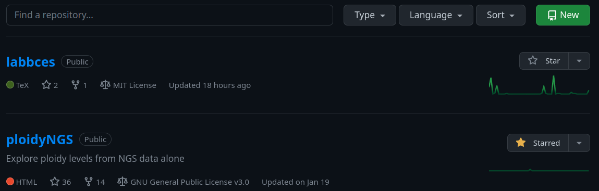
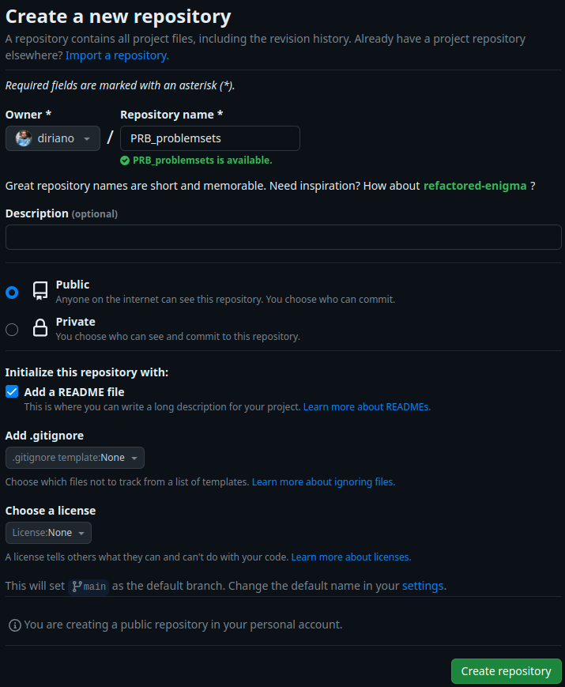

# Introdução a programação de computadores aplicada a ciências biológicas - CEN0336 2020-20
Tradução e modificação do material associado a [programmingforbiology.org](http://programmingforbiology.org), associado a disciplina ["CEN0336 - Introdução a Programação de Computadores Aplicada a Ciências Biológicas"](https://uspdigital.usp.br/jupiterweb/obterDisciplina?sgldis=CEN0336&codcur=11061&codhab=4)

__Criador e Instrutor da versão em Português__
Diego M. Riaño-Pachón

__Criadores do material na versão em Inglês__  
Simon Prochnik  
Sofia Robb     

# Panorama geral

## Por que?

Por que é importante para profissionais das ciências da vida aprender a programar?

Possivelmente você já tem a resposta a essa pergunta, a final das contas, você está aqui!

Estamos convencidos que saber programar é tão essencial quanto fazer uma eletroforese em gel ou preparar uma reação de PCR. Os dados que hoje podemos obter de um só experimento podem ser esmagadores. Esses dados muitas vezes precisam ser reformatados, filtrados e analisados de formas únicas. A programação de computadores permitirá que você execute essas tarefas de uma maneira **eficiente** e **reprodutível**.


## Dicas úteis

Algumas dicas para cursar uma disciplina de programação com sucesso:


1. Pratica, pratica, pratica. Por favor, invista tanto tempo como seja possivel escrevendo código.

2. Limite-se a escrever uma linha ou duas de codigo, e teste-las. Se você escreve muitas linhas, será mais dificil corregir os erros (debug), caso tiver.

3. Os erros não são fracassos. Cada erro é uma oportunidade de aprendizagem. Cada erro que você pesca e corrige (debug) e um grande sucesso. Corregir erros é como você cimenta seu aprendizado.

4. Não gaste muito tempo tentando descifrar um problema. Claro, é uma experiencia de aprendizado resolver os problemas você mesmo, mas a frustração e o bloqueio não são. Estamos aqui para ajuda-los, pergunte cada vez que precisar.

5. As palestras são importantes, mas a pratica e muito mais importante.

6. Sessões de revisão são importantes, mas a pratica e muito mais importante.

7. Nosso principal objetivo é ensinar-les a resolver problemas vocês mesmo, devagar mas com segurança.

---

# Unix

## Unix 1

### Panorama de Unix

#### O que é a linha de comandos?

Subjacente a quaisquer interfaces gráficas (GUI) existe um poderoso sistema operacional (SO) de linha de comandos. A linha de comandos oferece acesso ao interior do SO, e é também uma forma conveniente de escrever software e scripts personalizados.

Muitas das ferramentas bioinformáticas são desenvolvidas para serem executadas na linha de comando e não ter uma GUI. Em muitos casos, uma ferramenta na linha de comandos é mais versátil que uma ferramente gráfica, já que você pode combinar facilmente diversas ferramentas de linha de comandos para criar scripts que realizem tarefas sem a intervenção de um humano.

Nesta disciplina, vocês escreverão scripts na linguagem Python e os executarão exclusivamente de uma linha de comandos.

### O básico

#### Formas de acessar o terminal do Linux

Se você tem _**Windows 10**_:

 * Instalar Windows Subsystem for Linux, pode escolher entre algumas distribuições de Linux https://docs.microsoft.com/pt-br/windows/wsl/install
 * Usar uma máquina virtual, e.g., VirtualBox, você escolhe qualquer distribuição de Linux (usamos Lubuntu na sala de aula) https://itsfoss.com/install-linux-in-virtualbox/
 * DualBoot installation: https://itsfoss.com/install-ubuntu-1404-dual-boot-mode-windows-8-81-uefi/

Se você tem _**MacOS**_:

 * Já tem um sistema operacional baseado em UNIX, é só usar o terminal
 * Se você quer ter Linux, pode usar uma máquina virtual

De _**qualquer SO – Online no navegador**_:
 * [OnWorks](https://www.onworks.net/runos/create-os.html)

Durante a disciplina vamos usar muito esse terminal.

#### OK. Estou no terminal. E agora?

A janela da terminal está executando uma **shell** chamada de "bash." A shell é um loop (ciclo) que:  
1. Imprime o prompt
2. Lê uma linha de entrada do teclado
3. Analisa a linha em um ou mais comandos
4. Executa os comandos (geralmente imprimindo algum tipo de saida no terminal)
5. Volta ao passo 1.


Existem muitas shells diferentes, com nomes bizarros como **bash**, **sh**, **csh**, **tcsh**, **ksh**, e **zsh**.  A particula "sh" no nome, significa shell. Cada shell é sutilmente diferente e algumas vezes confusa.


#### Prompt da linha de comandos


A maior parte da bioinformática é feita executando software numa shell da linha de comandos, por isso é importante aprender a usar a shell de forma efetiva.


Este é um exemplo de prompt na linha de comandos:

```
cen0336>
```


Aqui tem outro:

```
(~) 51%
```

Mais um:

```
dria@cen0336 1:12PM>
```

Outro:

```
[renato.santos@frontend Pvi]$
```

O que você vai ter como prompt depende de como o administrador do sistema fez a configuração. Mas, você pode mudá-lo, [claro depois de saber como!](https://linuxconfig.org/bash-prompt-basics).

O prompt indica à shell que está pronto para aceitar comandos. Quando um programa esta rodando, o prompt não aparece até que o sistema estiver pronto para lidar com uma nova solicitação.

#### Executando comandos


Escreva um comando e pressione a tecla &lt;Enter&gt;.  Se o comando produz alguma saida, esta aparecerá na tela.  Por exemplo:

```
(~) 53% ls -F
GNUstep/                 cool_elegans.movies.txt  man/
INBOX                    docs/                    mtv/
INBOX~                   etc/                     nsmail/
Mail@                    games/                   pcod/
News/                    get_this_book.txt        projects/
axhome/                  jcod/                    public_html/
bin/                     lib/                     src/
build/                   linux/                   tmp/
ccod/
(~) 54%
```

O comando aqui é `ls -F`, que gera uma lista dos arquivos e pastas dentro da pasta atual (já falaremos disso). Abaixo do comando aparece sua saída, e o prompt aparece novamente.


Alguns programas podem demorar muito tempo para rodar. Depois que você executa eles, não recuperará o prompt da shell até eles terminarem a tarefa que lhes foi encomendada. Nesse caso você poderia abrir um novo terminal para continuar seus trabalhos ou rodar o comando no segundo plano adicionando o simbolo "&" após o comando, no final da linha.

```
(~) 54% long_running_application &
(~) 55%
```
> Assim o comando vai rodar no segundo plano até terminar. Se ele gerar alguma saida, ela vai aparecer na tela. Seria bom você capturar a saida num arquivo (isso é chamado de redirecionamento). Depois vamos descrever como fazer isso.


#### Edição da linha de comandos

A maioria das shells permite editar a linha de comandos.  Até o momento em que você pressiona a tecla \<Enter\>, você pode voltar na linha de comandos e editá-lo usando o teclado.  Aqui tem algumas das combinações de teclas mais úteis:

- _Backspace_: Apagar o caractere anterior.
- _zatra esquerda_, _zeta direita_: Move o ponto de inserção de texto (cursor) um caractere para a esquerda ou direita.
- _control-a (^a)_: Move o cursor para o início da linha. (Mnemônico: A é a primeira letra do alfabeto).
- _control-e (^e)_: Move o cursor até o final da linha. (Mnemônico: E pela palavra "End")
- _control-d (^d)_: Apagar o caractere atualmante abaixo do cursos. D=Delete.
- _control-k (^k)_: Apagar a linha desde onde esteja o cursor até o final. k=kill.  Na verdade a linha não é apagada, ela é colocada num local temporario chamado de "kill buffer". Isto é como cortar texto.
- _control-y (^y)_: Colar o conteúdo do "kill buffer" na linha de comandos, no ponto onde estiver o cursor.  y=yank.
- _zata acima_, _zeta abaixo_: Move o cursor para acima e para abaixo na historia de comandos.  Muito útil para rodar comandos que já foram rodados, possivelmente depois de modificá-los.

Tem também alguns comandos úteis da shell que você pode usar:

- `history` Mostra todos os comandos que você usour recentemente, numerados.
- `!<number>` Executar novamente um comando, baseado no seu número na historia (Você pode obter o número com o comando `history`).
- `!!` Executar novamente o comando imediatamente anterior.
- `!<pedaço de um comando>`: Executar novamente um comando anterior que começava como as letras indicadas.  Por exemplo, `!l` (a letra 'ele', não o número 1) executará novamente o comando `ls -F` que usamos no inicio deste capítulo.

A shell **bash** oferece os serviçoes de auto-completar e correção ortográfica. Se você escreve parte de um comando e usa a tecla de tabulação, a shell mostrará para você todas as formas possiveis de completar o comando.  Por exemplo:

```
(~) 51% fd<tab><tab>
(~) 51% fd
fd2ps    fdesign  fdformat fdlist   fdmount  fdmountd fdrawcmd fdumount
(~) 51%
```
> Se você teclar tab após escrever um comando, mas antes de pressionar a tecla \<Enter\>, **bash** mostrará uma lista de nomes de arquivos. Isto acontece porque muito comandos operam em arquivos.

#### Curingas

Você pode utilizar curingas ao se referir aos arquivos.  `*` significa zero ou mais caracteres.  `?` significa qualquer caractere (presença opcional).  Por exemplo, para listar todos os arquivos com a extensão ".txt", digite `ls` com o curinga padrão "*.txt"

```
(~) 56% ls -F *.txt
final_exam_questions.txt  genomics_problem.txt
genebridge.txt            mapping_run.txt
```

Existem padrões mais avançados de curingas, poder ler sobre eles na página de manual do **tcsh**.  Por exemplo, se você quer selecionar os arquivos que começam com os caracteres "f" ou "g" e que terminam com ".txt", pode usar uma faixa de caracteres dentro de colchetes `[f-g]` como parte de seu coringa. Aqui tem um exemplo:

```
(~) 57% ls -F [f-g]*.txt
final_exam_questions.txt  genebridge.txt            genomics_problem.txt
```

#### Lar doce lar


Quando você entra no terminal, chegará numa parte do sistema que é sua pasta pessoal, chamada de _home directory_.  Você pode fazer o que você quiser nessa área: pode criar e apagar arquivos e outras pastas. De forma geral, você não pode criar arquivos em outras pastas do sistema.

Sua pasta home está localizada dentro sistema de arquivos da máquina (poderia ser um servidor, por exemplo). Nela, como na maioria dos sistemas Linux e muitos Unixes, esta pasta tem seu nome de usuário, e está localizada em `/home`. A rota completa é `/home/usuário`.  A shell permite abreviá-lo como `~usuário` (onde usuário é seu nome de usuário no sistema), ou simplesmente como `~`. Esse caractere é chamado de "til" ou "twiddle".

Para ver o que você tem na sua pasta home, execute os comandos:

```
(~) % cd ~/
(~) % ls -F
INBOX         Mail/         News/         nsmail/       public_html/
(~) % ls 
INBOX         Mail         News         nsmail       public_html

```

Qual é a difereça entre os comandos `ls -F` e `ls`?

Este comando mostra um arquivo "INBOX" e quatro pastas adicionais ("Mail", "News").  (A particula `-F` no comando liga a opção para saida sofisticada ('fancy'), que acrescente alguna caracteres especiais nas listas de pastas, para ajudá-lo na identificação do que está observando.  O simbolo `/` no final do nome de um arquivo indica que o arquivo é uma pasta.


Algumas pastas podem ter arquivos e outras pastas que não aparacem quando executa o comando `ls -F`, eles estão ocultos. Os nomes desses aquivos e pastas ocultos iniciam com um `.` ("ponto") . Para conseguir ver esses arquivos e pastas, tem que acrescentar uma `a` nas opções do comando `ls`:

```
(~) % ls -aF
./                .cshrc            .login            Mail/
../               .fetchhost        .netscape/        News/
.Xauthority       .fvwmrc           .xinitrc*         nsmail/
.Xdefaults        .history          .xsession@        public_html/
.bash_profile     .less             .xsession-errors
.bashrc           .lessrc           INBOX
```
> Whoa!   Tem um monte de coisas lá. Pero por favor não vai apagar eses aquivos. Muitos deles são esenciais para a configuração de outros programas. Por exemplo o artuivo `.profile` contem as informações para a configuração da shell **bash**. Você pode dar uma olhadinha nele para ver algumas das muitas opções de **bash**. Você pode também editá-lo (claro quando você saiba o que está fazendo) para modificar o comportamento da shell, como por exemplo o typo de prompt que você tem, o as rotas de busca de comandos.


#### Conhecendo o sistema de arquivos


Você pode se deslocar de uma pasta para outra usando o comando `cd`. Você só tem que dar o nome da pasta para onde você quer ir. Pode usar o comando `pwd`para saber onde você está. Em algumas configurações o prompt também informa o nome da pasta onde você está.

```
(~/docs/grad_course/i) 56% cd
(~) 57% cd /
(/) 58% ls -F
bin/         dosc/        gmon.out     mnt/         sbin/
boot/        etc/         home@        net/         tmp/
cdrom/       fastboot     lib/         proc/        usr/
dev/         floppy/      lost+found/  root/        var/
(/) 59% cd ~/Mail/
(~/Mail) 60% pwd
/home/dria/Mail
(~/Mail) 62% cd ../News/
(~/News) 63% ls
Ace-browser/               bass.patch
Ace-perl/                  cgi/
Foo/                       cgi3/
Interface/                 computertalk/
Net-Interface-0.02/        crypt-cbc.patch
Net-Interface-0.02.tar.gz  fixer/
Pts/                       fixer.tcsh
Pts.bak/                   introspect.pl*
PubMed/                    introspection.pm
SNPdb/                     rhmap/
Tie-DBI/                   sbox/
ace/                       sbox-1.00/
atir/                      sbox-1.00.tgz
bass-1.30a/                zhmapper.tar.gz
bass-1.30a.tar.gz
(~/News) 64%
```
> Cada pasta tem duas pastas especiais chamadas de `.` e `..`. A primeira, `.` refere-se sempre ao diretório atual. `..` refere-se ao diretório pai. Desta forma você pode se deslocar para cima na hierarquia de diretórios:

```
(~/Mail) 64% cd ..
```

e pode fazer coisas arbitrariamente bizarras como esta:

```
(~/Mail) 65% cd ../../dria/Mail
```
> O ultimo comando sobe dois niveis, e logo vai na pasta Mail que está dentro da pasta chamada `dria`.


Se você ficar perdido no sistema de arquivos, o comando `pwd` imprimirá o caminho completo da pasta onde você está:

```
(~) 56% pwd
/home/dria
```

#### Comandos essenciais de Unix


Com exceção de poucos comandos que estão construídos diretamente na shell, todos os comandos de linux são programas executáveis autônomos. Quando você escreve um comando, a shell buscará em todas as pastas listadas na variavel de ambiente PATH por um executavel com o mesmo nome. Se acha-lo, então a shell o executará. Se não, imprimirá o erro "command not found".

A maioria dos comandos estão em `/bin`, `/usr/bin`, ou `/usr/local/bin`.

#### Obtendo informação dos comandos


O comando `man` le dará uma breve sinopsis do comando. Vamos obter informação do comando `wc`

```
(~) 76% man wc
Formatting page, please wait...
WC(1)                                                       WC(1)

NAME
       wc - print the number of bytes, words, and lines in files

SYNOPSIS
       wc [-clw] [--bytes] [--chars] [--lines] [--words] [--help]
       [--version] [file...]

DESCRIPTION
       This manual page documents the  GNU  version  of  wc.   wc
       counts  the  number  of bytes, whitespace-separated words,
...
```

#### Encontrando quais comandos estão disponíveis no seu computador

O comando `apropos` procurará comando que batem com uma palavra chave ou uma frase. Aqui tem um exemplo usando a palavra chave 'column'

```
(~) 100% apropos column
showtable (1)        - Show data in nicely formatted columns
colrm (1)            - remove columns from a file
column (1)           - columnate lists
fix132x43 (1)        - fix problems with certain (132 column) graphics
modes
```


#### Argumentos e switches na linha de comando


Muitos comandos aceitam argumentos.  Frequentemente os argumentos são os nomes de um ou mais arquivos nos quais o comando fará alguma operação. Muitos comandos também aceitam "switches" ou 'opções' na linha de comandos, que podem ajustar de forma fina o que o comando faz.  Alguns comandos reconhecem "switches' curtos, isto é, que consistem de um sinal de menos `-` seguido de um único caracter, enquanto outros reconhecem 'switches' longos, que consistem de dois sinais de menos `--` seguidos de uma palavra inteira.


O programa `wc` (word count) é um exemplo de comando que reconhece tanto opções longas como curtas. Você pode passar as opções `-c`,  `-w` e/ou `-l` para contar caracteres, palavras e linhas num arquivo de texto, respectivamente. Ou você pode usar o formato mais longo das opções, mais fácil de ler, `--chars`,  `--words` ou `--lines` .  Os próximos dois exemplos contam o número de caracteres e de linhas no arquivo de texto  `/var/log/messages`:

```
(~) 102% wc -c -l /var/log/messages
     23     941 /var/log/messages
(~) 103% wc --chars --lines /var/log/messages
     23     941 /var/log/messages
```

Você pode agrupar switches curtos, concatenando-lhes, como se mostra neste exemplo:

```
(~) 104% wc -cl /var/log/messages
     23     941 /var/log/messages
```

Muitos comandos mostrarão um pequeno resumo da forma de uso quando você chamar com as opções -h` ou `--help.

#### Espaços e caracteres estranhos

A shell usa espaços em branco (espaços, tabs, e outros catacteres não imprimíveis) para separar argumentos.  Se você deseja usar espaços em branco em um argumento, tem que usar aspas simples ao redor dele. For Exemplo: 

```
mail -s 'Uma mensagem importante' 'Bob Ghost <bob@ghost.org>'
```

Esse comando enviará uma mensagem de e-mail para a pessoa fictícia Bob Ghost. O switch `-s` aceita um argumento, que será o tema do e-mail. Já que o tema desejado pode conter espaços, tem que usar aspas ao redor. De forma semelhante, meu nome e endereço de e-mail, que podem ter espeços, têm que usar aspas da mesma forma. 

Alguns caracteres especiais não imprimíveis têm _códigos de escape_ associados


| Código de Escape | Descrição                               |
| ----------- | -------------------------------------------- |
| \\n         | Caracter de linha nova                       |
| \\t         | Caracter tabulação (TAB)                     |
| \\r         | Caracter de retorno de carro                 |
| \\a         | Caracter de campainha (ding! ding!)          |
| \\nnn       | O caracter que tem cõdigo ASCII **nnn**      |


#### Comandos úteis

Aqui tem alguns comandos que são usados com muita frequência.  Pode usar o comando  `man` para parender mais deles.  Alguns desses comandos podem ser de muita utilidade para resolver alguns dos exercicios ;-)

#### Manipulando pastas

| Comando | Descrição                              |
| ------- | ---------------------------------------- |
| `ls`    | Mostrar em forma de lista o conteúdo de uma pasta. O uso mais frequente é como  `ls -F` (lista decorada), `ls -l` (lista larga), `ls -a` (listar todos os arquivos). |
| `mv`    | Renomear ou mover um arquivo ou pasta.      |
| `cp`    | Copiar um arquivo.                             |
| `rm`    | Apagar um arquivo.                  |
| `mkdir` | Criar uma pasta.                         |
| `rmdir` | Apagar uma pasta.                       |
| `ln`    | Criar um vínculo simbólico ou rigido.          |
| `chmod` | Mudar as permissões de um arquivo ou uma pasta. |


| Comando           | Descrição                              |
| ----------------- | ---------------------------------------- |
| `cat`             | Programa para concatenar. Pode ser usado para concatenar múltiplos arquivos em um único arquivo, ou, com maior frequencia, para visualizar o conteúdo de um ou varios arquivo no terminal.|
| `echo`            | Imprime na tela uma copia de algum texto. E.g. `echo 'Hola Mundo!'` |
| `more`            | Navegar num arquivo pagina a pagina; Muito útil para visualizar o conteúdo de arquivos grandes. Funciona inclusive com arquivos que nem sequer podem ser visualizados num editor de texto. |
| `less`            | É uma versão do comando more, com ainda mais recursos.  |
| `head`            | Visualizar as primeiras linhas de um arquivo. Você pode controlar quantas linhas visualizar. |
| `tail`            | Vizualizar o final de um arquivo.  Você pode controlar quantas linhas visualizar.  Pode usar  `tail -f` para visualizar um arquivo onde está escrevendo. |
| `wc`              | contar palavras, linhas e/ou characteres em um ou mais arquivos. |
| `tr`              | Substituir um caracater por outro.  também é útil para apagar caracteres. |
| `sort`            | Ordenar as linhas de um arquivo de forma alfabetica ou numérica. |
| `uniq`            | Apagar linhas duplicada num arquivo.       |
| `cut`             | Apagar colunas de cada linha de um ou mais arquivos. |
| `fold`            | Ajustar o comprimento de linha a um maximo especificado. |
| `grep`            | Filtrar as linhas de um arquivo selecionando aquelas que tem um padrão especificado.  Pode faver o contrário, e mostrar as linhas que nõ tem o padrão especificado. |
| `gzip` (`gunzip`) | Comprimir (descomprimit) um arquivo.            |
| `tar`             | Arquivar (ou desarquivar) um pasta interia em um arquivo único. |
| `emacs`           | O editor de textos Emacs (bom para expertos). |
| `vi`              | O editor de textos vi  (melhor para expertos). |


#### Rede

| Command                | Description                              |
| ---------------------- | ---------------------------------------- |
| `ssh`                  | Uma forma segura (encriptada) de entrar em seridores remotos. |
| `scp`                  | Uma forma segura de copiar arquivos de e até servidores remotors. |
| `ping`                 | Conferir se um servidor remoto está ligado.              |
| `ftp`/ `sftp` (secure) | Transferir arquivos com o protocolo de transferencia de arquivos (File Transfer Protocol). |

#### Entrada/Saída (E/S) padrão e redirecionamento


Os comandos de Unix se comumicam via a interface de linha de comandos. Eles podem imprimir informacão no terminal para você visualizar e também podem aceitar entradas desde o teclado (o seja, de  _você_!)


Cada programa de Unix inicia com três conexoes ao mundo exterior.  Essas conexões são chamadas de "correntes" ou "streams", porque agem como se fosem uma corrente de informacão(metaforicamente falando):


| Tipo de Corrente     | Descrição                              |
| --------------- | ---------------------------------------- |
| Entrada padrão  | É uma corrente de comunicacões inicialmente atrelada ao teclado. Quando o programa lê da entrada padrão, ele lê qualquer cosa que você digitar. |
| saída padrão | Esta corrente está inicialmente atrelada ao terminal. Qualquer coisa que o programa imprimir nesta cenal aparecerá na sua janela do terminal. |
| Erro padrão  | Esta corrente esta, também, inicialmente atrelada ao terminal. É um canal separado com o intuito de imprimir messages de erro. |

La palavra "inicialmente" tem que levar a pensar que os padrões de entradas, saida e de erro, podem de alguma forma ser desatrelados de seus locais de inicio, e atrelados a algum outro. Isso é correto! Você pode atrelar uma o mais dessas correntes a um arquivo, ou incluso a um outro programa.  Isso pode parecer esoterico, mas é na verdade muito útil.

#### Um exemplo simples


O programa  `wc` conta linhas, caracteres e palavras nos dados enviados a usa entrada padrão.  Você pode usear ele de forma interactiva assim::

```
(~) 62% wc
Mary tinha um cordeirinho,
cordeirinho,
cordeirinho.

Mary tinha um cordeirinho,
cuja a lã era branca como a neve.
^d * NOTE - Precisa digitar isto, mas não será impresso no terminal (O sinal `^` corresponde a tecla `control`)
      6      20     107
```
En este exemplo, executei o programa `wc` .  Ele aguardou para eu escrever um pequeno poema. Quando terminei, usei o character FIM-DE-ARQUIVO (END-OF-FILE), control-d (^d ).  Então `wc` imprimiu três números, que representam o número de linhas, palavras e caracteres na entrada.

Frequentemente, você vai querer contar o número de linhas em um arquivo grande; como um arquivo cheio de sequências de DNA.  você pode fazer isso ao _redirecting_ os conteúdos do arquivo para a entrada padrão `wc`. Isso usa
o `<`  símbolo:

```
(~) 63% wc < big_file.fasta
      2943    2998     419272
```

Se você quisesse gravar essas contas pra posteriormente, você pode redirecionar a saída padrão também com o `>` símbolo:

```
(~) 64% wc < big_file.fasta > count.txt
```


Agora se você `cat` o arquivo _count.txt_, verá que a conta foi gravada.  `cat` funciona pegando a entrada padrão e copiando-a para a saída padrão. Nós redirecionamos a entrada padrão do _count.txt_ arquivo, e deixamos a saída padrão predefinida, anexada ao terminal:

```
(~) 65% cat < count.txt
      2943    2998     419272
```

#### Meta-caracteres de redirecionamento

Aqui está a lista completa de comandos de redirecionamento para `bash`:

| Comando             | Descrição                                |
| ------------------- | ---------------------------------------- |
| `< myfile.txt`      | Redireciona os conteúdos do arquivo para a entrada padrão |
| `> myfile.txt`      | Redireciona a saída padrão para o arquivo         |
| `>> logfile.txt`    | Acrescenta uma saída padrão para o final do arquivo |
| `1 > myfile.txt`    | Redireciona apenas a saída padrão para o arquivo (Assim como acima) |
| `2 > myfile.txt`    | Redireciona apenas o erro padrão para o arquivo     |
| `&> myfile.txt` | Redireciona tanto o stdout quanto o stderr para o arquivo  |


Eles podem ser combinados.  Por exemplo, esse comando redireciona a entrada padrão do arquivo chamado `/etc/passwd`, escreve seus resultados no arquivo `search.out`, e escreve suas mensagens de erro (se tiver) dentro de um arquivo chamado `search.err`.  O que ele faz? Ele pesquisa o arquivo chave para um usuário chamado "root" e retorna todas linhas que se referem a esse usuário.

```
(~) 66% grep root < /etc/passwd > search.out 2> search.err
```

#### Filtros, Nomes de arquivos, e entrada padrão

Muitos Unix comandos agem como filtros, pegando informação de um arquivo ou entrada padrão, transformando a informação, e escrevendo os resultados para saída padrão.  A maioria dos filtros são programados então se eles forem chamados com um ou mais nomes de arquivo na linha de comando, eles usarão estes arquivos como entradas.  Porém eles agirão como entradas padrão.  Por exemplo, estes dois comandos são equivalentes:

```
(~) 66% grep 'gatttgc' < big_file.fasta
(~) 67% grep 'gatttgc' big_file.fasta
```
Ambos usam `grep` para pesquisar pela corda "gatttgc" no arquivo `big_file.fasta`.  O primeiro pesquisa entrada padrão, que acontece de ser redirecionado para o arquivo.  O segundo comando está explícitamente dando o nome do arquivo na linha de comando.


Às vezes você quer um filtro para agir em séries de arquivos, um dos quais acontece de ser a entrada padrão. Muitos comandos deixam usar `-` na linha de comando como em pseudônimos para a entrada padrão.  Exemplo:

```
(~) 68% grep 'gatttgc' big_file.fasta bigger_file.fasta -
```
Esse exemplo pesquisa por "gatttgc" em três lugares.  Primeiro olha no arquivo `big_file.fasta`, depois no `bigger_file.fasta`, e por úlitmo na entrada padrão (que, desde que não seja redirecionad, virá do teclado).


#### Padrão I/O e Tubos


A coisa mais legal de Unix shell é a possibilidades de acorrentar comandos juntos em tubulações.  Aqui um exemplo:

```
(~) 65% grep gatttgc big_file.fasta | wc -l
22
```
Três são dois comandos aqui. `grep` pesquisa pelo arquivo ou entrada padrão por linhas contendo uma corda particular.  As que contém a corda são impressas para a saída padrão.  `wc -l` é o programa de conta familiar, que conta palavras, linhas, e caracteres em um arquivo ou entrada padrão. A `-l` opção de linha de comando instrui `wc` para imprimir apenas a linha de conta.  O `|` caractere, conhecido como "cano", conecta os dois comandos juntos então a saída padrão de `grep` se torna a entrada inicial de `wc`. Pense nos canos conectando fluxos de informação a seguir. 


O que o cano faz?  ele imprime o número de linhas em que a corda "gatttgc" aparece no arquivo `big_file.fasta`.

#### Mais idiomas de cano

Canos são muito poderosos. Aqui estão alguns idiomas de linhas de comando comuns.

**Conte o número de vezes que o padrão NÃO aparece no arquivo**

O exemplo no começo da seção mostrou como contar o número de linhas em que um padrão particular de corda aparece no arquivo.  E se você contar o número de linhas em que o padrão **não** aparece?

Simples.  Faça o teste reverso `-v` trocar:

```
(~) 65% grep -v gatttgc big_file.fasta | wc -l
2921
```

**Singularizar linhas em um arquivo**


Se você tem uma longa lista de nomes em um arquivo de texto, e você quer eliminar os duplicados:

```
(~) 66% sort long_file.txt | uniq > unique.out
```
Isso funciona ordenando todas as linhas alfabeticamente e tubulando o resultado para o 'uniq' programa, que remove linhas duplicadas que ocorrem em sequência. Por conta disso você precisa ordenrar primeiro. A saída é colocada em um arquivo chamado 'unique.out'.

**Concatenar várias listas e remover duplicadas**


Se vocÊ tem muitas listas que podem conter entradas repetidas entre elas, você pode combinar elas em uma lista única ao concatenar elas juntas, depois ordenando e unificando-as como antes.

```
(~) 67% cat file1 file2 file3 file4 | sort | uniq
```

**Contar linhas únicas em um arquivo**


Se você só quer saber quantas linhas únicas existem no arquivo, adicione um 'wc' ao fim do tubo: 
```
(~) 68% sort long_file.txt | uniq | wc -l
```

**Página através de uma listagem de diretório muito longa**


Canalize a saída 'is' para o programa 'more', que mostra a página de uma vez. se você a tiver, o programa 'less' é ainda melhor:
```
(~) 69% ls -l | more
```

**Monitorar um arquivo em crescimento para padronizar**


Canalize a saída `tail -f` (que monitora um arquivo crescente e imprime as linhas novas) para 'grep'. Por exemplo, isso irá monitorar o arquivo `/var/log/syslog` para a aparência de e-mails endereçados a 'mzhang':
```
(~) 70% tail -f /var/log/syslog | grep mzhang
```

### Mais Unix

Aqui estão mais alguns comandos avançados de Unix que são muito úteis, e quando você tiver tempo deve investigar mais a fundo. Nós listamos números de páginas para a segunda edição do livro de frases Unix de Scott Granneman ou links para tutoriais online. 

 - `awk` (Linux Livro de frases p.194-198)([online tutorial](https://www.tutorialspoint.com/awk/index.htm))
 - `sed` (Linux Livro de frases p.188-194)([online tutorial](https://www.tutorialspoint.com/sed/index.htm))
 - `perl` one-liners ([online tutoral](https://catonmat.net/introduction-to-perl-one-liners))
 - `for` loops ([online tutorial](https://www.tutorialspoint.com/unix/for-loop.htm))

---


### [Link para o conjunto de problemas 1 de Unix](problemsets/Unix_01_problemset.md)


<div style="page-break-after: always;"></div>  


---
## Unix 2


### Editores de texto


Se é frequentemente necessário criar e escrever para um arquivo enquanto usanod o terminal. Isso torna essencial o uso de um editor de texto para o terminal. Existem muitos editores de texto. Alguns dos nossos favoritos são Emacs e vim. Nós vamos te introduzir com um editor de texto simples chamado 'vi'. 

### Introdução ao nano

Na próxima seção você conhecerá o editor de texto **vi**, que é um editor muito poderoso. Encorajamos você a aprender a usar o **vi**. as entendemos que o **vi** pode ser um pouco dificil de usar no inicio, por isso vamos a apresentar um editor muito mais simples, sem as características avanzadas que tem o **vi**. Esse editor é o **nano**

Como o **vi**, **nano** é um editor de texto da lihna de comandos, e assim, você não tem uma interface do mouse para interagir com o editor, tudo é feito com convinações de teclas.

#### Usando nano


__Abrindo um arquivo__

Na linha de comando pode escrever `nano` seguido do nome do arquivo que você quer abrir.

```bash
dria% nano <file>
```

Vamos tentar:

```bash
dria% nano primeiro_arquivo_nano.txt
```

Seu terminal aparecerá como segue:

```
  GNU nano 2.3.1               File: primeiro_arquivo_nano.txt                                    


^G Get Help     ^O WriteOut     ^R Read File    ^Y Prev Page    ^K Cut Text     ^C Cur Pos
^X Exit         ^J Justify	^W Where Is     ^V Next Page    ^U UnCut Text   ^T To Spell
```

Note que o nome do arquivo aparece na primeira linha. Se você iniciar o `nano` sem in dicar um nome de arquivo, na primeria linha aparecerá:

```
  GNU nano 2.3.1                      New Buffer                                                  
```

Nas ultimas dois linhas da sua tela tem varias combinações de teclas com diversas funções. O simbolo `^` indica que você tem que usar a tecla `control` na combinação. Por exemplo `^O`, significa que tem que usar as teclas `control` + `O` para escrever seu arquivo em disco.

### Introdução ao vi

O que é **vi**?

> **vi** é uma linha de comando de edição de texto. vi é incluso em qualquer instalação Linux. Portanto, você não precisa instalar. 


O que é uma linha de comando de edição de texto?

> Uma linha de comando de edição de texto é um editor de texto que você usa de uma linha de comando. Na maioria delas, não espere poder apontar e clicar. Você vai precisar navegar com as teclas do teclado. Os editores de texto mais populares são **vi** e **Emacs**. Você é livre para usar ambos, mas vamos começar com **vi** já que o pressionamento de teclas é menos complexo que em **emacs**. 


Por que eu me importo com linhas de comando de edição de texto?

> Se você está registrado em uma máquina remota, uma linha de comando de edição de texto é a mais rápida, fácil, e eficiente forma de escrever arquivos de texto. 


#### Começando com o vi


__Abrindo um arquivo__


Na linha de comando, digite `vi` seguido do nome do arquivo.

```bash
srobb% vi <file>
```


Vamos tentar:

```bash
srobb% vi first_vi_file.txt
```


Você verá isso em seu terminal.

```
~
~
~
~
~
~
~
~
~
~
~
~
~
~
~
~
~
"first_vi_file.txt" [New File]
```

Repare o nome do arquivo na parte inferior.


Se você **não** incluir o nome do arquivo você verá algo como isso: 

```bash
~
~
~
~
~                                                VIM - Vi IMproved
~
~                                                version 8.0.1283
~                                            by Bram Moolenaar et al.
~                                   Vim is open source and freely distributable
~
~                                          Become a registered Vim user!
~                                 type  :help register<Enter>   for information
~
~                                 type  :q<Enter>               to exit
~                                 type  :help<Enter>  or  <F1>  for on-line help
~                                 type  :help version8<Enter>   for version info
~
~
~

```

Leia o que a mensagem diz e digite `:q<Enter>` para **Q**uit ou sair.


__vi tem dois modos.__

1. **Insert Mode**

2. **Command Mode**

   

**Insert Mode** É para digitar o nome dos arquivos. Todas as teclas pressionadas serão interpretadas como caracteres que você quer ver em seu arquivo. 

**Command Mode** É para usar comandos. Todas as teclas pressionadas serão interpretadas como comando e **não** como parte do arquivo. Comandos comuns são para deletar, copiar, pesquisar, recolocar e salvar. 

 

#### Criando, Escrevendo, e salvando o percorrer de um arquivo


__Criar__

Da linha de comando abra um novo arquivo digitando:
`vi first_vi_file.txt` 


__Escrever__

Comece digitando o conteúdo. Para isso nós precisamos entrar no **modo inserir** 

Para isso digite `i`.


Sua sessão vi agora vai se parecer com isso: 

```bash
~
~
~
~
~
~
-- INSERT (paste) --
```

Repare o `INSERT` na parte inferior da tela.


Comece digitando os conteúdos do arquivo. Lembre que todas as teclas pressionadas são aquelas que você quer ver no seu arquivo e seu mouse não funcionará. 


__Salvar__


Agora que o arquivo contém alguns conteúdos vamos entrar no **modo de comando** para podermos salvar o arquivo. 


1. Pressione a tecla `<ESC>` para entrar no **modo de comando**.
2. Digite `:w` (dois pontos seguidos por w) para **Salvar (escrita)**


Se você quer digitar mais algum conteúdo, entre no **modo inserir** (`i`). 

Se, ao invés você quiser sair, desde que já estiver no modo de comando você pode usar o pressionamento de tecla `:q`


#### Atividades comuns e comandos vi 

Entre no **modo de comando** para todos os comandos. Se você assegurar que você está no **modo de comando**, apenas pressione a tecla `<esc>`. Isso não irá trazer problemas se você já estiver no **modo de comando** 


__Salvando e saindo__

Lembre-se de entrar no **modo de comando** com a tecla `<esc>` 

|teclas | significado | 
|-----------|---------|  
|`:wq` | Salvar (**W**rite) e **S**air |   
|`:q!` | **S**air sem salvar!!! |  
|`:w`  | Salvar (**W**rite) apenas |  

  

A maioria dos comandos com o vi são executados assim que você pressiona uma sequência de teclas. Qualquer começo de comando com os dois pontos ( : ) requerem que você pressione `<enter>` para completar o comando.


__Se locomovendo__

Lembre-se de entrar no **modo de comando** com a tecla `<esc>`

|Teclas | Significados | 
|-----------|---------|  
|Flechas  | movem o cursor ao redor |  
|`j`, `k`, `h`, `l` | movem o cursor para baixo, cima, esquerda e direita (similar as flechas) |  
|`0` (zero) | move o cursor para o começo da linha atual |  
|`^` (circunflexo) | move o cursor para o começo da linha atual |  
|`$`  | move o cursor para o fim da linha atual |  
|`:n` | move o cursor para o número de linhas do arquivo |  
|`nG` | move o cursor para o número da linha digitado (eg 5G move para a 5ª linha) |  
|`G` | move para a última linha |  
|`w` | move para o começo da próxima palavra |  
|`nw`| move adiante "n" palavras (eg 2w move duas palavras a frente) |  
|`b` | move para o começo da palavra anterior |  
|`nb` | move para trás "n" palavras |  


__Deletando conteúdo__

Lembre-se de entrar no **Modo de Comando** com a tecla '<esc>' 

|tecla pressionada | significado | 
|-----------|---------|  
|`x`        | deleta um caractere único  |   
|`nx`       | deleta n caracteres (eg 5x deleta cinco caracteres)  |  
|`dd`       | deleta a linha atual  |  
|`dn`       | d seguido por um comando de movimento. Deleta para onde o comando de movimento te levou. (eg d5w significa deletar 5 palavras)|  


__Desfazendo__

Lembre-se de entrar no **Modo de Comando** com a tecla '<esc>' 

|tecla pressionada | significado | 
|-----------|---------|  
| `u` | Desfaz a última ação (você pode manter u pressionado para continuar desfazendo)  |  
| `U` | (Nota: capital)** - Desfaz todas as mudanças na linha atual  |  


#### Outras dicas úteis

|tecla pressionada | significado | 
|-----------|---------|  
| `:set number` | exibe números de linha | 
| `:set nonumber` | desliga os números de linha |  
| `:/[search text]` | encontra [esse texto] em seu arquivo |  
| `n` | vai até a próxima ocorrência de seu resultado de busca | 

  

#### Caneca do vi


## Git para iniciantes

Git é uma ferramenta para gerenciar arquivos e versões de arquivos. é um _Sistema de Controle de Versão_. Ela te permite acompanhar as alterações. Você estará utilizando o Git para gerenciar seu trabalho de curso e manter sua cópia das notas de aula e arquivar nos dados. Git pode ajudar você a fazer tarefas muito difíceis com arquivos. Nós vamos vamos mantê-las simples.


### A maior figura.


Um Sistema de Controle de Verões é bom para colaborações, versões de armazenamento, restauração de versões anteriores, e gerenciar Backups.

#### Colaboração 

Usando um Sistema de Controle de Versões torna possível editar um documento com outros sem o medo de sobrescrever as mudanças de alguém, ainda que mais de uma pessoa esteja trabalhando na mesma parte do documento. Todas as mudanças podem ser mescladas em um documento. Estes documentos são todos armazenados em um lugar. 


#### Armazenando versões 

Um Sistema de Controle de Versões permite que você salve versões de seus arquivos e anexe notas para cada versão. Cada salvamento vai conter informação sobre as linhas que são adicionadas ou alteradas.

#### Restaurando Versões Anteriores 

Desde que você matém o rastreamento das versões, é possível reverter todos os arquivos de um projeto ou apenas um arquivo para uma versão anterior.


#### Backup  

Um Sistema de Controle de Versões faz com que você trabalhe localmente e sincronize seu trabalho remotamente. Isso significa que você terá uma cópia de seu projeto em seu computador e o Servidor do Sistema de Controle de Versões que você está usando.

#### Os detalhes

git é o Sistema de Controle de Versões que usaremos para monitorar mudanças em nossos arquivos.

[GitHub](https://github.com/) é a o Servidor do Sistema de Controle de Versões que estaremos utilizando. Eles providenciam contas gratuitas para quaisquer projetos públicos.


### O Básico

Normalmente você possui cópias locais de seu projeto/repositório e uma cópia remota. O repositório __local__ é armazenado em seu computador e o __remoto__ fica em um serviço online como o GitHub.
       


Você pode usar o buscador da web para interagir com o servidor remoto (github) e o terminal para interagir com o repositório local.

### Criando um novo repositório 

Um repositório é um projeto que contém todos os arquivos do projeto, e guarda cada revisão histórica de arquivos, Repositórios podem ter múltiplos colaboradores. Repositórios normalmente possuem dois componentes, um __remoto__ e outro __local__.


Siga os passo 1 e 2 para criar o __repositório remoto__.   

Siga o passo 3 para criar seu __repositório local__ e **conectá-lo** ao __repositório remoto__.   


1. Navegue para GitHub --> Create Account / Log In --> Vá para Repositories --> Clique 'New'  

    

2. Adicione um nome (i.e., PFB_problemsets) e uma descrição (i.e., Solutions for PFB Problem Sets) e clique "Create Repository"  

    


3. Crie um diretório em seu computador, navegue dentro dele, depois siga as instruções fornecidas.  

    
    

    


O novo repositório local consiste em três "árvores" mantidas por git. A primeira é seu "Working Directory" que mantém os arquivos atuais. O segundo é o "Index" que atua como área de preparação e finalmente a "HEAD" que aponta para o úlitmo envio que você fez.

Todo repositório local git tem três elementos prinicpais chamados _árvores (trees)_:
1. O _Working Directory_ contém seus arquivos
2. O _Index_ é a área de preparação
3. O _HEAD_ Aponta para o último envio que você fez.
> Aqui estão algumas palavras novas. Nós as explicaremos posteriormente


__Revendo os Comandos__


| comando                                 | descrição                              |
| --------------------------------------- | ---------------------------------------- |
| `git init`                              | Cria seu novo repositório local com as três árvores (máquina local) |
| `git remote add remote-name URL`        | Conecta seu repositório local para um repositório __remoto__ que é chamado de _origin_ e é encontrado na URL dada |
| `git add filename`                      | Propõe mudanças e adiciona arquivo(s) com mudanças para o index ou área de preparação (máquina local) |
| `git commit -m 'message'`               | Confirma ou envia que você realmente quer adicionar suas mudanças para o HEAD (máquina local) |
| `git push -u remote-name remote-branch` | Envia suas mudanças confirmadas na HEAD para o repositório remoto especificado e o ramo específico |


__Me siga__

Cria um repositório **local** que é conectado a um **remoto**. 'git remote add' conecta seu local ao remoto. Antes deste comando o local não saberá nada sobre o remoto e vice versa. 

1. Cria um novo repositório remoto no github.
2. Siga todas as instruções fornecidas a você no github.

Adicion alguns arquivos para seu novo repositório:

3. Muda diretório para seu repositório local
4. Cria um novo arquivo com o vi: `vi git_exercises.txt`
5. Adiciona uma linha de texto para o novo arquivo.
6. Salva `:w` e sai `:q`
7. (Add) Propõe suas mudanças. `git add git_exercises.txt`
8. (Commit) Se certifica que você quer suas mudanças. `git commit -m 'added a line of text'`
9. (Push) Sincroniza/Upload suas mudanças para o repositório __remoto__. `git push origin master`


Estas são todas as funcionalidades! Existem mais algumas coisas complicadas de se fazer, mas não iremos nos adentrar, Você saberá quando estiver pronto para aprender mais sobre git quando descobrir algo que você quer fazer mas não sabe como. Existem milhares de tutoriais online para você pesquisar e seguir.


#### Mantendo o monitoramento de diferenças entre repositórios locais e remotos

Se você pensa no que você precisa adicionar em seu repositório remoto use o comando `git status`. Isso irá fornecer uma lista de arquivos que foram modificados, deletados, e aqueles que não são rastreados. Arquivos não rastreados sçao aqueles que nunca foram adicionados a fase de preparação com o `git add`

| comando                                 | descrição                              |
| --------------------------------------- | ---------------------------------------- |
| `git status` | Para ver a list dos arquivos que foram modificados, deletados, e aqueles que não são rastreados |


#### Deletando e movendo arquivos

|comando | descrição |
| ------ |-------------|
| `git rm` | Remove arquivos do index, ou da working tree e do index |
| `git mv` | Move ou renomeia um arquivo, um diretório, ou um symlink |

> Estes dois comandos vão atualizar seu index assim como alterar seus arquivos locais. Se você usar apenas `rm` ou `mv` você vai ter que atualizar o index com add/commit. 

#### Conseguir uma cópia do arquivo em seu remoto

Às vezes você acaba bagunçando um arquivo, ou deletando sem querer. Porém existe uma cópia do github remoto. Como acessá-la?

```
git checkout <filename>
```
> Whew, que salva vidas!  


#### Dicas

1. Adicionando arquivos acima de 50M vai quebrar seu git repo. Não adicione arquivos largos. Não use `git add -A` quando existem arquivos grandes dentro. Você não quer isso. 
2. Não clone o repositório git dentro de outro. Isso prejudica o git. 
3. Não tenha medo de perguntar coisas ao google. git pode ser complicado e várias pessoas fazem perguntas que são respondidas em fórums online, ou GitHub terá um tutorial


### Clonando um Repositório

Algumas vezes você quer baixar e usar o repositório de alguém. Isso é uma forma diferente de criar o próprio repositório. É apenas uma cópia do repositório de alguém

Vamos clonar o material do curso.

Vamos lá!

1. Vá para nosso [PFB GitHub Repository](https://github.com/prog4biol/pfb2019)
2. Clique no botão de 'Clone or Download'
3. Copie o URL
  ~[Clone PFB2019](images/github-clone.png)
4. _Clone_ o repositório para sua máquina local
   `git clone https://github.com/prog4biol/pfb2019.git`

Agora você tem uma cópia do material do curso no seu computador!

#### Trazendo mudanças do repositório remoto para o local

Se mudanças são feitas em quaisquer arquivos online, remotos, e você quer atualizar sua cópia local você pode _pull_ as mudanças.
`git pull`  

| comando                                 | descrição                              |
| --------------------------------------- | ---------------------------------------- |
| `git pull` | Para conseguir mudanças do remoto para sua cópia local |


#### Links para tópicos *levemente* menos básicos  

Você saberá se precisar usar quaisquer desses recurso do git.

1. [Ver o histórico de Commit](https://git-scm.com/book/en/v2/Git-Basics-Viewing-the-Commit-History)
2. [Resolvendo problemas de mesclagem](https://help.github.com/articles/resolving-a-merge-conflict-using-the-command-line/)
3. [Desfazendo Commits anteriores](https://github.com/blog/2019-how-to-undo-almost-anything-with-git)

---

### [Link para o conjunto de problemas Unix 2](problemsets/Unix_02_problemset.md)

---
